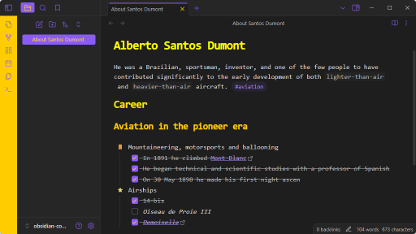

# Obsidian Consolas Theme

A dark theme for sober individuals.



This theme employs a TrueType font that evokes the look and feel of Visual Studio Code, adored by many developers and designers for its readability.

Characteristics and features:
- Popular monospaced font
- Yellow and purple color scheme
- Gradual header shading
- Calendar compatibility
- Checkboxes inspired by Minimal (by kepano)

## Setup

Clone to your obsidian vault using Git.

```
$ cd .obsidian/themes
$ git clone https://github.com/pinei/obsidian-consolas-theme "Consolas"
```

Set in "Config > Appearance > Themes¨

## References:

- [Obsidian - Build a theme](https://docs.obsidian.md/Themes/App+themes/Build+a+theme)
- [Top Programming Fonts](https://github.com/hbin/top-programming-fonts/)
- [Embed fonts and images](https://docs.obsidian.md/Themes/App+themes/Embed+fonts+and+images+in+your+theme)
- [Encode TTF Font](https://products.aspose.app/font/base64/ttf)